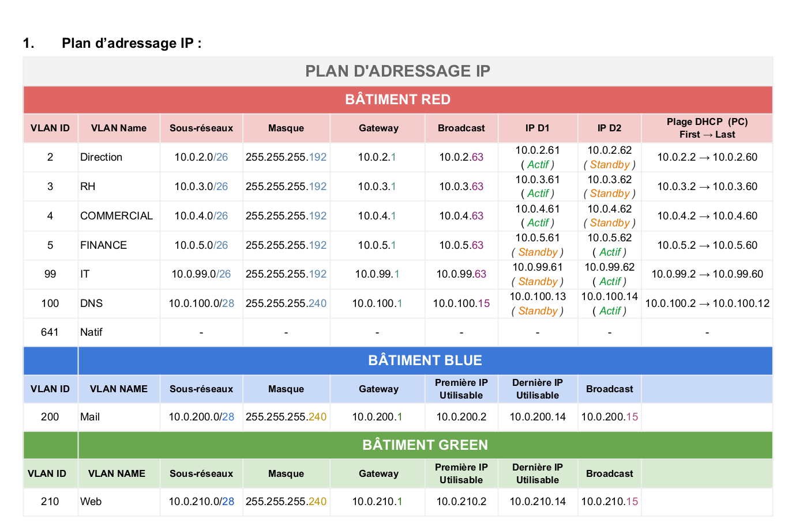
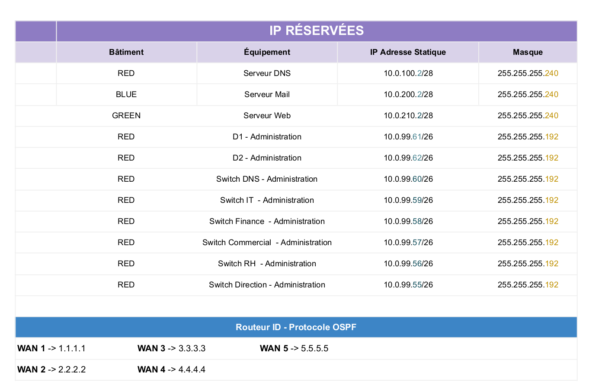
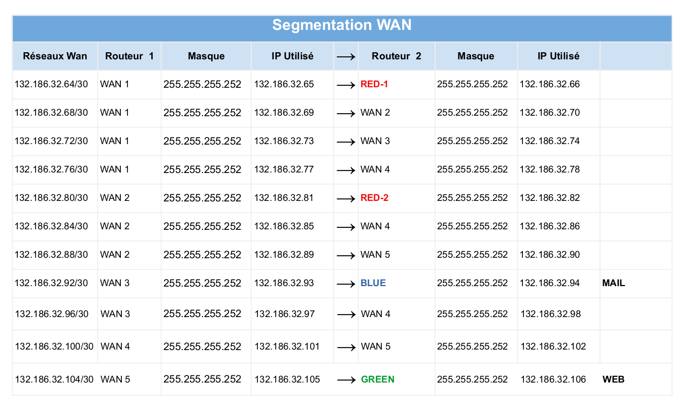
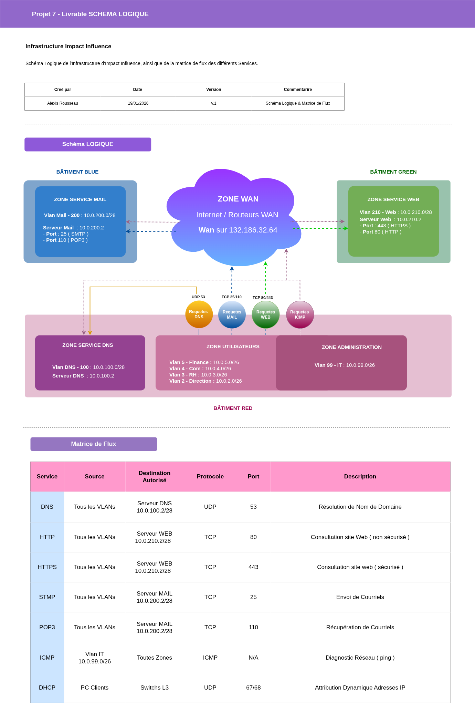
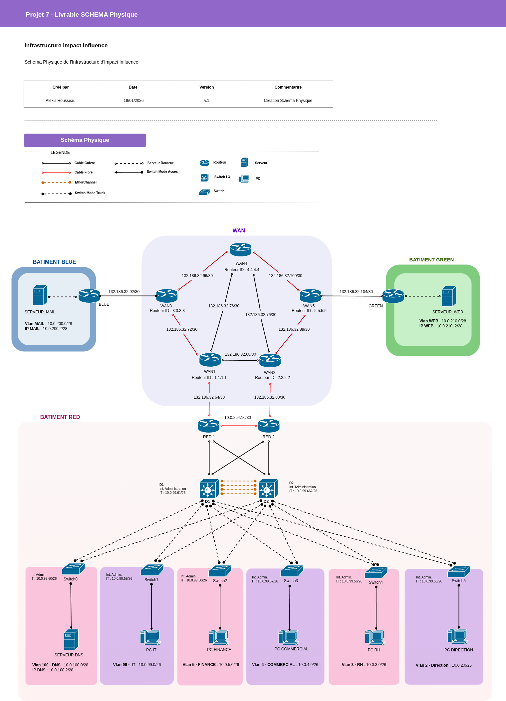
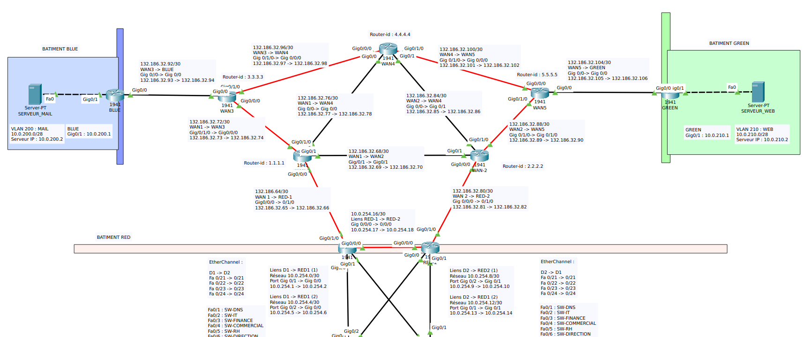
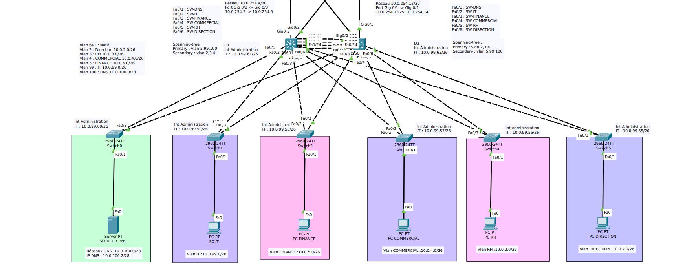

# 🌐 Projet Architecture Réseau Multi-Sites : Impact Influence

Projet de fin de mission - Administrateur Systèmes, Réseaux et Cybersécurité

## 1. Présentation du Projet
Ce projet consiste en la conception et le déploiement d'une infrastructure réseau critique pour la société **Impact Influence**. 

L'architecture simule un siège social (Bâtiment RED) interconnecté à des agences distantes et des zones de services (GREEN & BLUE) via un cœur de réseau WAN.

L'accent a été mis sur la **résilience** (zéro interruption de service) et la **sécurité proactive** (filtrage granulaire des flux).

## 2. Objectifs de la mission
- **Haute Disponibilité** : Éliminer tout point de défaillance unique (Single Point of Failure) au niveau du cœur de réseau.

- **Segmentation** : Isoler les flux métiers (Finance, RH, IT, etc.) via des VLANs.

- **Routage Dynamique** : Implémenter OSPF pour une gestion automatique des routes sur le WAN.

- **Services Critiques** : Déployer et sécuriser les serveurs DNS, WEB (HTTP/S) et MAIL (SMTP/POP3).

- **Sécurité** : Filtrer les accès via des ACLs étendues et masquer l'adressage interne via le NAT.

## 3. Synthèse de l'Architecture Technique

### A. Haute Disponibilité (L2/L3)
- **Redondance de distribution** : EtherChannel (LACP) entre les switches D1 et D2 pour l'agrégation de bande passante.

- **Redondance de passerelle** : Implémentation du protocole HSRP (IP Virtuelle .1) garantissant une bascule transparente en cas de panne matérielle.

- **Prévention des boucles** : Configuration du Rapid-PVST+ pour une convergence optimale du Spanning-Tree.

### B. Routage et Interconnexion
- **Dynamique** : Déploiement du protocole OSPF (Area 0) sur le cœur de réseau WAN pour une résilience et une évolutivité maximales.

- **Sécurisation** : Utilisation de passive-interface et filtrage des annonces de réseaux privés.

- **Sortie Internet** : Routes statiques flottantes pour assurer la continuité de l'accès WAN.

### C. Sécurité et Publication (Cybersécurité)
- **NAT Overload** : Masquage de l'adressage interne pour les accès Internet.

- **NAT Statique** : Publication sécurisée du serveur Web (Port 80/443) et Mail (Port 25/110).

- **ACLs Étendues** : Application de la politique de sécurité "Moindre Privilège" au plus proche de la source (Inbound sur interfaces VLAN).

### D. Service Déployé
- Service **DNS**
- Service **DHCP** 
- Service **Mail** ( TCP 25 / 110 ) 
- Service **Web** ( TCP 80 / 443 )

## 📂 4. Livrables inclus
- 📁 Maquette_Packet_Tracer.pkt : Topologie complète configurée.
- 📁 *Rousseau_Alexis_1_configuration_equipements_012026.pdf* : Plan Adressage, configurations complètes
- 📁 *Rousseau_Alexis_3_procedure_test_012026.pdf*: Détail des tests et captures d'écran.
- 📁 *Rousseau_Alexis_4_schema_logique_012026.pdf* : Matrice des ports et protocoles.
- 📁 *Rousseau_Alexis_5_schema_physique_012026.pdf* : Représentation Physique de l’infrastructure

## 5. Plan Adressage 

## 6. Schema Logique & Matrice de Flux 

## 7. Schéma Physique 

## 8. Procédures de Test et Validation
- Procédure Complète de Test dans ***Rousseau_Alexis_3_procedure_test_012026.pdf***

Cette procédure comprend les différentes commandes associées, objectif des tests et dépannage. 

Chaque brique de l'architecture a été validée par des tests de rupture :
- **Simulation de panne D1** : Bascule HSRP vers D2 validée sans perte de session TCP.

- **Coupure lien EtherChannel** : Maintien de la connectivité via les liens redondants.

- **Audit de sécurité (ACL)** : Validation du blocage des pings inter-VLANs.

- **Services DNS/Web** : Validation via nslookup et accès navigateur en mode simulation.

## 9. Capture Maquette sous Ciso Packet Tracer

*( Je vous invite a lire la Procédure Technique pour toutes les configurations et Validation Technique  )*

## 👨‍💻 9. Note de l'Administrateur

Ce projet m'a permis de consolider ma capacité à concevoir des réseaux robustes en environnement Cisco. La complexité de l'interconnexion entre la redondance L2/L3 et les politiques de sécurité applicative (ACL/NAT) reflète les défis réels rencontrés en entreprise.

---

---

**Auteur** : Rousseau Alexis

**Rôle** : Administrateur Systèmes, Réseaux & Cybersécurité

**Date** : Janvier 2026

